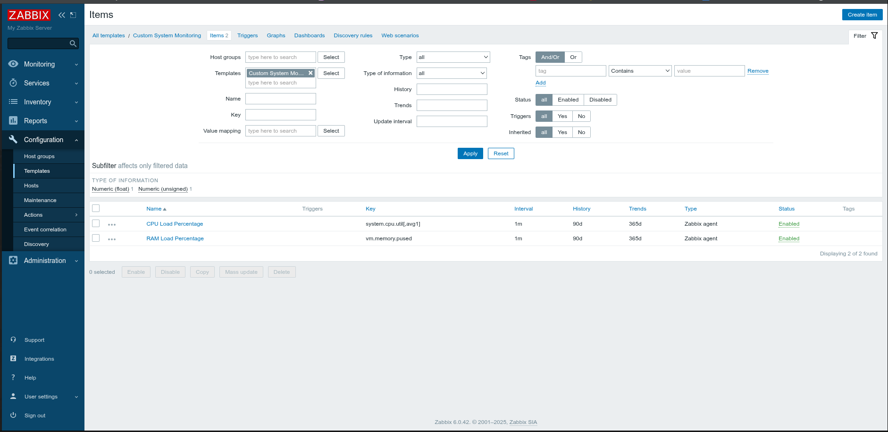
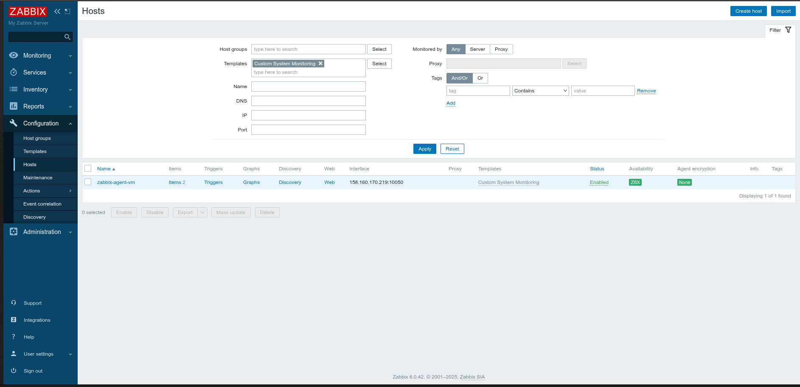
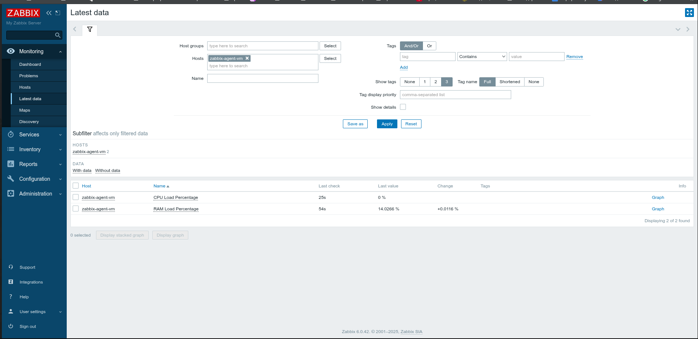
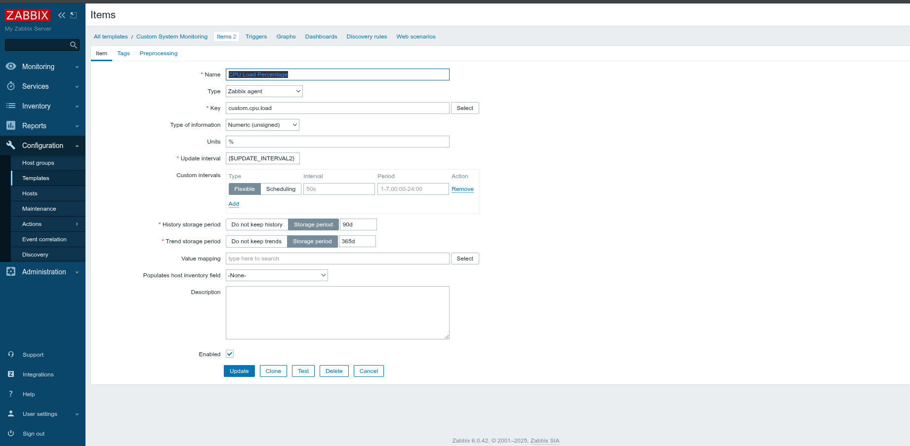
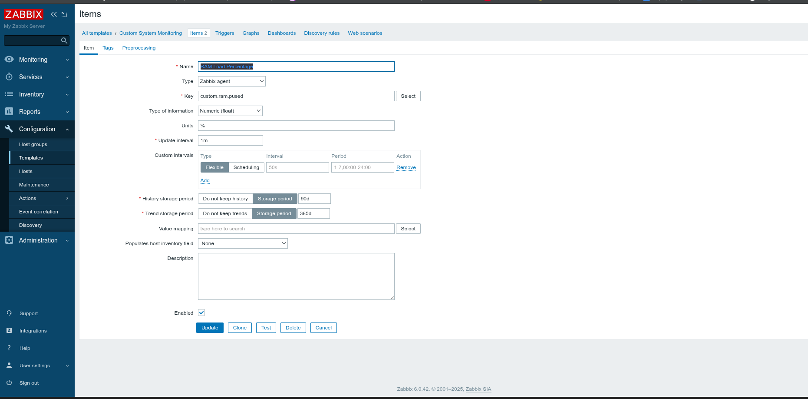
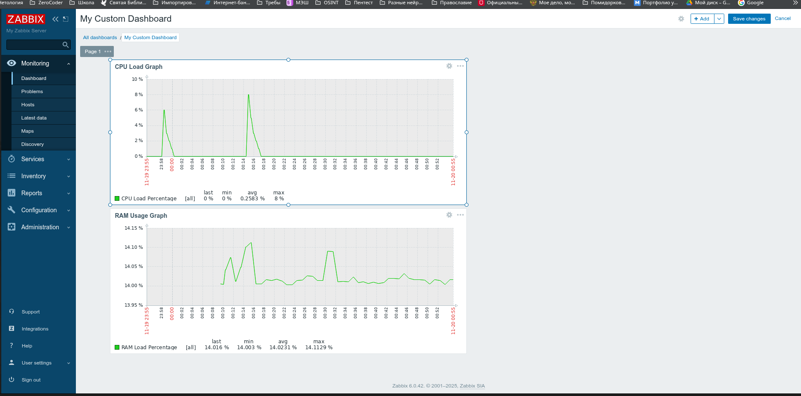
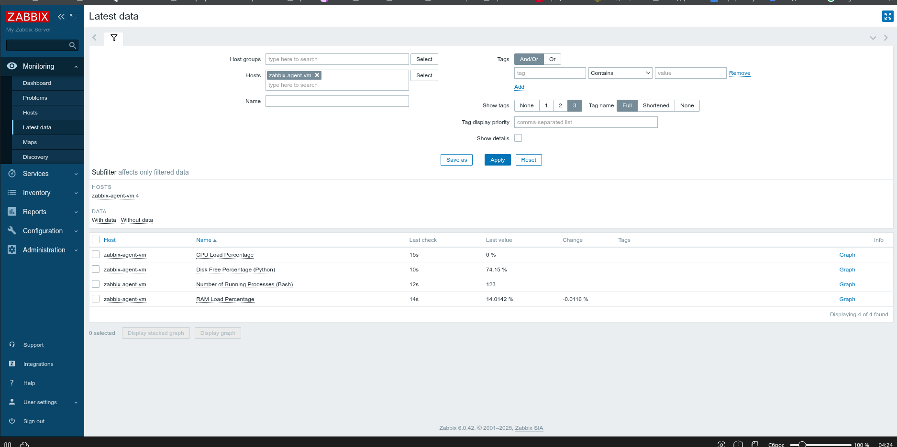
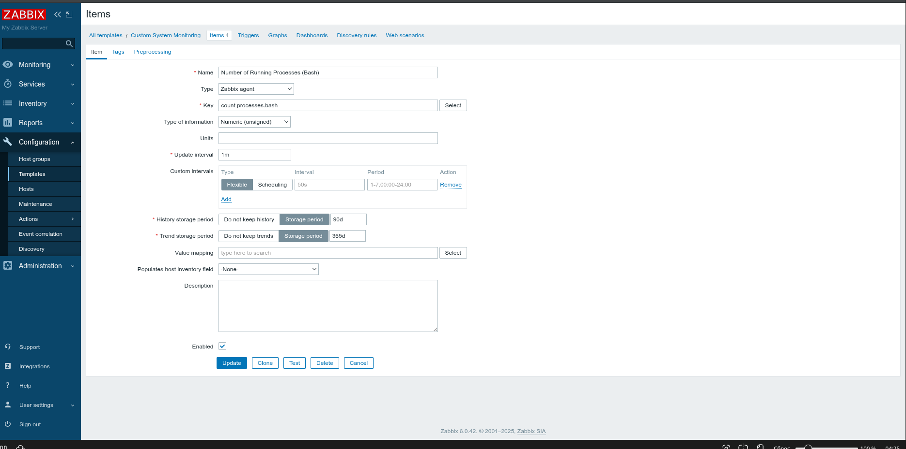

Домашнее задание к занятию "Название занятия" - Шарова Олега

Инструкция по выполнению домашнего задания

    Сделайте fork данного репозитория к себе в Github и переименуйте его по названию или номеру занятия, например, https://github.com/имя-вашего-репозитория/git-hw или https://github.com/имя-вашего-репозитория/7-1-ansible-hw).
    Выполните клонирование данного репозитория к себе на ПК с помощью команды git clone.
    Выполните домашнее задание и заполните у себя локально этот файл README.md:
        впишите вверху название занятия и вашу фамилию и имя
        в каждом задании добавьте решение в требуемом виде (текст/код/скриншоты/ссылка)
        для корректного добавления скриншотов воспользуйтесь инструкцией "Как вставить скриншот в шаблон с решением
        при оформлении используйте возможности языка разметки md (коротко об этом можно посмотреть в инструкции по MarkDown)
    После завершения работы над домашним заданием сделайте коммит (git commit -m "comment") и отправьте его на Github (git push origin);
    Для проверки домашнего задания преподавателем в личном кабинете прикрепите и отправьте ссылку на решение в виде md-файла в вашем Github.
    Любые вопросы по выполнению заданий спрашивайте в чате учебной группы и/или в разделе “Вопросы по заданию” в личном кабинете.

Желаем успехов в выполнении домашнего задания!
Дополнительные материалы, которые могут быть полезны для выполнения задания

    Руководство по оформлению Markdown файлов

---

### Задание 1

Создайте свой шаблон, в котором будут элементы данных, мониторящие загрузку CPU и RAM хоста.

#### Этапы выполнения:

1.  В веб-интерфейсе Zabbix перешёл в **Configuration** -> **Templates**.
2.  Создал новый шаблон с именем `Custom System Monitoring`.
3.  Добавил Item `CPU Load Percentage` с ключом `system.cpu.util[,avg1]`.
4.  Добавил Item `RAM Load Percentage` с ключом `vm.memory.pused`.





### Задание 2

Привязал кастомный шаблон `Custom System Monitoring` к хосту `zabbix-agent-vm` и проверил поступление данных.

#### Этапы выполнения:

1.  Убедился, что Zabbix Agent на `zabbix-agent-vm` работает и настроен на подключение к серверу `158.160.193.234`.
2.  В веб-интерфейсе Zabbix перешёл в **Configuration → Hosts**.
3.  Отредактировал хост `zabbix-agent-vm` и добавил шаблон `Custom System Monitoring` в раздел **Templates**.
4.  Для Item `RAM Load Percentage` заменил ключ `vm.memory.pused` на UserParameter `custom.ram.pused`, чтобы избежать ошибки `Unsupported item key`.
5.  Изменил тип значения для `RAM Load Percentage` на `Numeric (float)`, чтобы корректно обрабатывать дробные числа.
6.  Проверил, что в **Monitoring → Latest data** поступают данные:
    - `CPU Load Percentage`
    - `RAM Load Percentage`







### Задание 3

Создан кастомный дашборд для мониторинга хоста `zabbix-agent-vm`.

#### Этапы выполнения:

1.  Перешёл в **Monitoring** → **Dashboards**.
2.  Создал новый дашборд с именем `My Custom Dashboard`.
3.  Добавил следующие виджеты:
    -   **Graph (classic):** График загрузки CPU (`CPU Load Percentage`)
    -   **Graph (classic):** График использования RAM (`RAM Load Percentage`)
4.  Настроил расположение виджетов и сохранил дашборд.





### Задание 4

Созданы UserParameter на Bash и Python-скрипт, добавлены в шаблон.

#### Этапы выполнения:

1.  На ВМ `zabbix-agent-vm` создан Bash-скрипт `/usr/local/bin/count_processes.sh`, возвращающий количество запущенных процессов.
2.  В конфигурацию агента добавлен UserParameter: `UserParameter=count.processes.bash,/usr/local/bin/count_processes.sh`.
3.  На ВМ `zabbix-agent-vm` создан Python-скрипт `/usr/local/bin/disk_free_percentage.py`, возвращающий свободное место на диске `/` в процентах.
4.  В конфигурацию агента добавлен UserParameter: `UserParameter=disk.free.percentage.python,/usr/local/bin/disk_free_percentage.py`.
5.  В шаблон `Custom System Monitoring` добавлены Items:
    -   `Number of Running Processes (Bash)` с ключом `count.processes.bash`.
    -   `Disk Free Percentage (Python)` с ключом `disk.free.percentage.python`.
6.  Проверено, что данные поступают в **Monitoring → Latest data**.





#### Код Bash-скрипта

```bash
#!/bin/bash
# Скрипт возвращает количество запущенных процессов
ps aux --no-headers | wc -l

```

Код Python-скрипта

```python
#!/usr/bin/env python3
import shutil
import sys

def main():
    # Путь к корню файловой системы
    path = '/'
    try:
        total, used, free = shutil.disk_usage(path)
        # Вычисляем процент свободного места
        free_percent = (free / total) * 100
        # Выводим результат (Zabbix ожидает число)
        print(f"{free_percent:.2f}")
    except Exception as e:
        # Если произошла ошибка, выводим 0 или логируем (для простоты)
        print(0)
        sys.exit(1)

if __name__ == "__main__":
    main()

